______________________________________________________________________

<div align="center">

# GAN Implementation

<a href="https://pytorch.org/get-started/locally/"></a>
<a href="https://pytorchlightning.ai/"></a>
<a href="https://hydra.cc/"></a>
<a href="https://github.com/ashleve/lightning-hydra-template"></a><br>

</div>

## Description

My implementation of GAN, DCGAN, cGAN.

## How to run

Install dependencies

```bash
# clone project
git clone https://github.com/phamgialinhlx/GANs
cd GANs

# [OPTIONAL] create conda environment
conda create -n gan python=3.8 -y
conda activate gan

# install pytorch according to instructions
# https://pytorch.org/get-started/

# install requirements
pip install -r requirements.txt
```

Train model with default configuration

```bash
# train on CPU
python src/train_gan.py trainer=cpu

# train on GPU (default)
python src/train_gan.py 
```

You can override any parameter from command line like this

```bash
# train on FashionMNIST dataset
python src/train_gan.py datamodule=fashion_mnist
# use cGAN model
python src/train_gan.py model=cgan
# use DCGAN model with small architecture (image size: 28 x 28)
python src/train_gan.py model=small_dcgan 
```
## Results

Unconditional generation

</div>
<div style="display: flex; box-sizing: border-box;">
  <div style="flex: 33.33%;  padding: 5px; box-sizing: border-box;">
    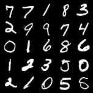
    <h3 align="center">Real images in MNIST dataset</h3>
  </div>
  <div style="flex: 33.33%;  padding: 5px; box-sizing: border-box;">
    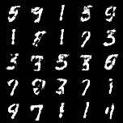
    <h3 align="center">Fake images generated by GAN</h3>
  </div>
    <div style="flex: 33.33%;  padding: 5px; box-sizing: border-box;">
    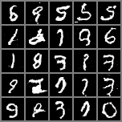
    <h3 align="center">Fake images generated by DCGAN</h3>
  </div>
</div>

<div style="display: flex; box-sizing: border-box;">
  <div style="flex: 33.33%;  padding: 5px; box-sizing: border-box;">
    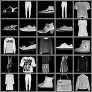
    <h3 align="center">Real images in Fashion MNIST dataset</h3>
  </div>
  <div style="flex: 33.33%;  padding: 5px; box-sizing: border-box;">
    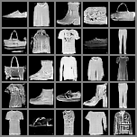
    <h3 align="center">Fake images generated by DCGAN</h3>
  </div>
</div>

<br>

<div style="display: flex; box-sizing: border-box;">
  <div style="flex: 33.33%;  padding: 5px; box-sizing: border-box;">
    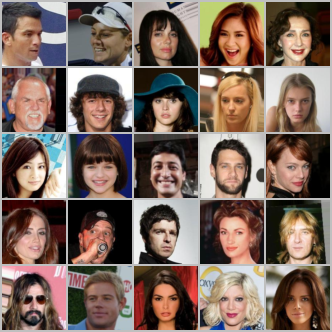
    <h3 align="center">Real images in GENDER dataset</h3>
  </div>
  <div style="flex: 33.33%;  padding: 5px; box-sizing: border-box;">
    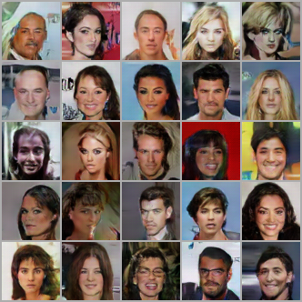
    <h3 align="center">Fake images generated by DCGAN</h3>
  </div>
</div>


Conditional generation

<div style="display: flex; box-sizing: border-box;">
  <div style="flex: 33.33%;  padding: 5px; box-sizing: border-box;">
    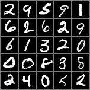
    <h3 align="center">Real images in MNIST dataset</h3>
  </div>
  <div style="flex: 33.33%;  padding: 5px; box-sizing: border-box;">
    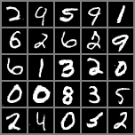
    <h3 align="center">Fake images generated by cGAN</h3>
  </div>
</div>


<div style="display: flex; box-sizing: border-box;">
  <div style="flex: 33.33%;  padding: 5px; box-sizing: border-box;">
    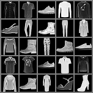
    <h3 align="center">Real images in Fashion MNIST dataset</h3>
  </div>
  <div style="flex: 33.33%;  padding: 5px; box-sizing: border-box;">
    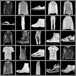
    <h3 align="center">Fake images generated by cGAN</h3>
  </div>
</div>
